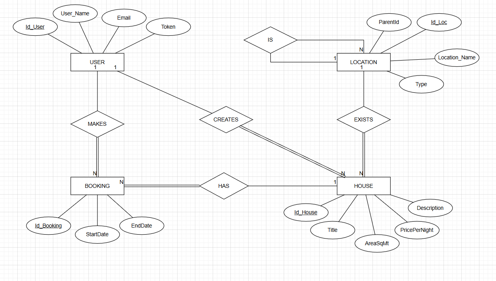
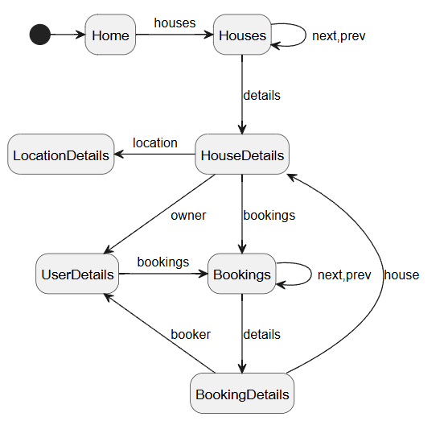

# Report

# Introduction

This document describes the design and implementation decisions for the LS project, covering the three development phases of the system.

The project consists of a house rental management platform composed of a backend HTTP API and a Single Page Application (SPA) frontend. The system allows client applications and users to manage users, locations, houses, and bookings.

The backend is implemented using the Kotlin programming language and uses the HTTP4K library to handle HTTP requests and responses. Data serialization and deserialization are performed using the kotlinx.serialization library. Application data is stored in a PostgreSQL database, while tests use in-memory data storage to ensure testability and independence from external infrastructure.

The frontend is implemented using vanilla JavaScript, following a modular architecture with a custom client-side router and a small Domain-Specific Language (DSL) for building HTML elements dynamically.

Throughout the project phases, the application evolved incrementally:

- Initially, the backend HTTP API was implemented, including support for users, locations, houses, and bookings.

- Afterwards, a Single Page Application was introduced to provide a Web User Interface for interacting with the backend through dynamic navigation without full page reloads.

- The SPA was then extended with support for creation, update, and deletion workflows, advanced navigation features, availability visualization, search functionality, and improved user interaction mechanisms.

- Finally, Phase 4 introduced credential-based authentication, including user registration and login functionality, session management in the SPA, and deployment of the complete application to the Render cloud platform using Docker containers and a PostgreSQL database.

The system follows a layered architecture composed of domain, data access, service, and web API components on the backend, complemented by a modular SPA on the frontend. This separation of concerns improves modularity, readability, maintainability, and extensibility.

The following sections describe the database modeling, software organization, backend implementation, frontend SPA design, and the additional features introduced in the latest iteration of the project.
## Modeling the database

### Conceptual model
The following diagram holds the Entity-Relationship model for the information managed by the system.

The system is composed of the following main entities:
- User

- Location

- House

- Booking




We highlight the following aspects of the conceptual model:

- A User represents a person registered in the system. Each user has a unique identifier, a name, a unique email address, and an authentication token used for API access.

- A Location represents a geographical entity. Locations are organized hierarchically using a parent-child relationship, allowing the representation of structures such as countries, districts, municipalities, and localities.

- A House represents a property available for booking. Each house is associated with a location and is created by a user, who is considered the owner of the house.

- A Booking represents a reservation made by a user for a specific house during a given time interval.

The relationships between entities are the following:

- A user can create multiple houses, but each house is associated with exactly one user.

- A user can create multiple bookings.

- A house can have multiple bookings associated with it.

- A house belongs to a single location.

- A location may contain multiple sub-locations, forming a hierarchical structure.

The conceptual model has the following restrictions:

- The email of a user must be unique in the system.

- A location may optionally reference a parent location, allowing the creation of hierarchical geographical structures.

- The type of a location must be one of the following values: COUNTRY, REGION, DISTRICT, MUNICIPALITY, or LOCALITY.

- Each house must be associated with a valid location.

- Each booking must be associated with an existing user and house.

- The start date of a booking must be earlier than the end date.

- A house cannot have overlapping bookings for the same time interval.

In phase 4, it was added support for credential-based authentication, allowing users to register and log in. The password attribute was added to the User entity, and the authentication token is now generated upon successful login.


### Physical Model


The physical model of the database is implemented using PostgreSQL and follows the conceptual model. It includes four main tables (users, locations, houses, bookings) and one enumerated type (location_type).

The complete schema definition can be found in the SQL script available at:

[Schema](https://github.com/isel-leic-ls/2526-2-LEIC42D-G02/blob/main/src/main/sql/createSchema.sql)


#### Data Types and Identifiers

- All entities use auto-incremented primary keys (SERIAL):
    - users.id_user
    - locations.id_loc
    - houses.id_house
    - bookings.id_booking

- The location_type is implemented as a PostgreSQL ENUM:
    - COUNTRY, REGION, DISTRICT, MUNICIPALITY, LOCALITY

- The token field in the users table is stored as a UUID, ensuring global uniqueness.


#### Users

- The users table enforces:
    - email as UNIQUE
    - token as UNIQUE

- This guarantees:
    - No duplicate users with the same email
    - Unique authentication tokens per user

The users table also contains an additional field:

- password

Constraints:

- password cannot be null
- password is required during user creation

This allows users to authenticate using their credentials and obtain an authorization token through the login operation.

#### Locations (Hierarchical Model)

- The locations table implements a self-referencing hierarchy:
    - parent_id → locations.id_loc

- Constraint behavior:
    - ON DELETE SET NULL

- This means:
    - When a parent location is deleted, its children are not removed but become root locations.

- This design supports hierarchical geographical structures such as:
    - Country → Region → District → Municipality → Locality


#### Houses

- Each house:
    - Is associated with a location (location_id)
    - Has an owner (owner_id)

- Constraints:
    - area_sq_mt >= 0
    - price_per_night > 0

- Foreign keys:
    - location_id → locations.id_loc (ON DELETE CASCADE)
    - owner_id → users.id_user (ON DELETE CASCADE)

- This ensures:
    - Deleting a location removes all associated houses
    - Deleting a user removes all houses owned by that user


#### Bookings

- Each booking:
    - Is associated with a user (user_id)
    - Is associated with a house (house_id)

- Constraint:
    - CHECK (end_date >= start_date)

- Foreign keys:
    - user_id → users.id_user (ON DELETE CASCADE)
    - house_id → houses.id_house (ON DELETE CASCADE)

- This ensures:
    - Deleting a user removes their bookings
    - Deleting a house removes its bookings


#### Preventing Overlapping Bookings

Overlapping bookings are prevented at the database level using the following constraint:

```sql
EXCLUDE USING gist (
    house_id WITH =,
    daterange(start_date, end_date, '[]') WITH &&
)
```
- This constraint ensures that:
    - Two bookings for the same house cannot overlap in time.


- It relies on:
    - The btree_gist PostgreSQL extension
    - The daterange type for interval comparison.


#### Indexes and Performance

The following indexes are defined to improve query performance:

- idx_house_location on houses(location_id)
    - Optimizes filtering houses by location


- idx_booking_house on bookings(house_id)
  - Optimizes retrieval of bookings per house


- idx_booking_dates on (start_date, end_date)
    - Optimizes date range queries

#### Design Decisions
- Data integrity is enforced at both database and application levels
- ENUM type improves consistency and validation
- CASCADE deletes simplify maintenance of dependent data
- Overlapping bookings are enforced at the database level to prevent concurrency issues.

## Software organization

The system follows a layered architecture that separates concerns into distinct components. This organization improves modularity, maintainability, and testability.

The main packages are:

- houses.domain → domain model
- houses.data → data access layer
- houses.services → business logic
- houses.webapi → HTTP API layer
- houses.server → application entry point


### Domain Layer (houses.domain)

This layer defines the core domain model of the application.

It includes:

- Entities:
    - User
    - Location
    - House
    - Booking

- Value objects:
    - Email
    - Name
    - PricePerNight
    - Description

- Supporting types:
    - LocationType
    - Id

- Phase 4 additions:
    - Password

#### Responsibilities

- Represent business concepts
- Enforce invariants using require:
    - Valid email format
    - Non-empty strings
    - Positive price values
    - Valid booking dates
    - Valid location hierarchy

This ensures that invalid objects cannot be created.


### Data Layer (houses.data)

This layer is responsible for data storage and retrieval.

#### Repository Interfaces

- UserRepository
- LocationRepository
- HouseRepository
- BookingRepository

These define the contract for data access operations.

#### Implementations

- **In-memory repositories**:
    - MemUserRepository
    - MemLocationRepository`
    - MemHouseRepository
    - MemBookingRepository

  Used for:
    - Unit testing
    - Early development

- **JDBC implementation**:
    - JdbcUserRepository

  Uses:
    - java.sql.Connection
    - Prepared statements
    - ResultSet mapping

#### Connection Management

- Implemented using a helper function:

```kotlin
withConnection { connection -> ... }
```
- Ensures:
    - Automatic connection closing
    - Safe execution of database operations

### Service Layer (houses.services)

This layer implements the business logic of the application.

#### Services
- UserService
- LocationService
- HouseService
- BookingService

#### Responsibilities
- Coordinate operations between repositories
- Enforce business rules

Examples:

- BookingService:
    - Prevents overlapping bookings

- UserService:
  - Handles token-based authentication

- LocationService:
  - Provides hierarchical queries (children, full path)

- HouseService:
  - Handles house creation and retrieval

### Authentication Support

Phase 4 introduced authentication services based on user credentials.

The UserService now supports:

- User registration
- User authentication

User registration receives:

- name
- email
- password

and creates a new user together with an authentication token.

User authentication receives:

- username
- password

and returns:

- user identifier
- authentication token

The returned token is subsequently used by the SPA through the Authorization Bearer header.
 
### Web API Layer (houses.webapi)

This layer exposes the HTTP API using HTTP4K.

#### Components
- UserWebApi
- LocationWebApi
- HouseWebApi
- BookingWebAPI

#### Responsibilities
- Define routes
- Parse HTTP requests
- Validate inputs
- Call service layer
- Return HTTP responses

#### Serialization
- Uses kotlinx.serialization for:
  - Request parsing
  - Response generation

#### Authentication
- Implemented using:
``` kotlin
authenticate(request, userService)
```
- Extracts Bearer token from Authorization header
- Validates token using UserService

#### Authentication Endpoints

The API was extended with authentication support.

##### Create User

POST /users

Request body:
```kotlin
{
"name": "...",
"email": "...",
"password": "..."
}
```

Response:
```kotlin
{
"id": ...,
"token": "..."
}
```
#### Login

POST /users/login

Request body:
```kotlin

{
"name": "...",
"password": "..."
}
```

Response:
```kotlin

{
"id": ...,
"token": "..."
}
```
The endpoint validates the provided credentials and returns the user's authentication token.

### Server Layer (houses.server)

This is the application entry point.

#### Responsibilities
- Instantiate repositories, services, and web APIs
- Configure routing
- Start HTTP server (Jetty)

#### Example Flow
1. Create repositories
2. Inject into services
3. Inject services into Web API
4. Combine routes
5. Start server


#### Design Considerations
- Separation of concerns
    - Each layer has a clear responsibility

- Dependency injection
  - Components receive dependencies via constructor
  
- Testability
  - In-memory repositories allow tests without database
  
- Extensibility
    - Easy to replace in-memory repositories with JDBC implementations
  
- Validation at multiple levels
  - Domain (invariants)
  - Services (business rules)
  - Web API (input validation)


### Open-API Specification

The OpenAPI specification is available at:

[OpenAPI YAML](../docs/openapi.yaml)

In our Open-API specification, we highlight the following aspects:

- The API follows a restful design, with clear resource-based endpoints:
    - /users
    - /locations
    - /houses
    - /bookings

- Standard HTTP methods are used:
    - POST for resource creation
    - GET for resource retrieval

- Path parameters are used to identify specific resources:
    - Example: /houses/{id}

- Query parameters are used for filtering and pagination:
    - skip and limit for paging
    - startDate and endDate for booking queries

- All request and response bodies use JSON format

- The API includes input validation constraints:
    - Required fields are explicitly defined
    - Types are specified (integer, string, date, etc.)

- Authentication is defined using the Authorization header with Bearer token:
    - Required for protected endpoints such as creating houses, locations, and bookings

- The specification separates endpoints by functionality, improving readability and usability for frontend clients

- The design avoids exposing internal implementation details, focusing only on the external contract of the API

### Request Details

A request is processed through several layers of the system, following the architecture defined for the application.


#### Request Flow

1. **HTTP Request Reception (Web API Layer)**
    - The request is received by the HTTP server (Jetty) and routed using HTTP4K.
    - Routes are defined in the Web API classes:
        - UserWebApi
        - LocationWebApi
        - HouseWebApi
        - BookingWebAPI

   Example:
    - POST /houses is handled by HouseWebApi.postHouse

2. **Request Parsing**

- The request body is read and deserialized using `kotlinx.serialization`:

```kotlin
val body = Json.decodeFromString<Map<String, String>>(request.bodyString())
```
- Query and path parameters are extracted using HTTP4K:
  - request.path("id")
  - request.query("skip")

3. **Authentication (when required)**
   Authentication is performed in two stages.

##### Credential Validation

The user authenticates using:

- username
- password

through the login endpoint.

If the credentials are valid, the server returns:

- user identifier
- authentication token

##### Authorization

For protected operations, the SPA sends the received token using the Authorization header:

Authorization: Bearer <token>

The authenticate(request, userService) helper validates the token and retrieves the corresponding user.

4. **Service Layer Execution**
- After validation, the request is delegated to the service layer:
  - UserService
  - LocationService
  - HouseService
  - BookingService
- Services implement business logic and coordinate repository access.

Examples:

- HouseService.createHouse(...)
- BookingService.createBooking(...)
- Business rules are enforced here, such as:
  - Preventing overlapping bookings
  - Ensuring valid date intervals

5. **Data Access (Repository Layer)**
- Services interact with repositories:
    - In-memory implementations (e.g., MemHouseRepository)
    - JDBC implementation (e.g., JdbcUserRepository)
- Repositories handle data storage and retrieval.

6. **Response Construction**
- Domain objects are converted into response DTOs:
  - HouseResponse
    - BookingResponse
    - UserResponse

- These are serialized into JSON using kotlinx.serialization:
``` kotlin
Json.encodeToString(responseObject)
```

- The response is returned with an appropriate HTTP status:
  - 200 OK
  - 201 CREATED
  - 400 BAD REQUEST
  - 404 NOT FOUND

#### Internal Classes and Functions

The most relevant components involved in request processing are:

- Web API Layer
  - Classes: UserWebApi, LocationWebApi, HouseWebApi, BookingWebAPI
  - Functions: postUser, postHouse, postBooking, get...

- Authentication
  - Function: authenticate(request, userService)

- Service Layer
  - Classes: UserService, LocationService, HouseService, BookingService

- Repository Layer
  - Interfaces: UserRepository, HouseRepository, etc.
  - Implementations: Mem..., JdbcUserRepository

#### Parameter Validation

Validation is performed at multiple levels:

1. Web API Layer

- Checks for missing parameters using explicit validation:
```kotlin
body["name"] ?: error("Missing name")
```

- Type conversions enforce correctness:
  - toInt()
  - LocalDate.parse(...)

- Query validation:
  - startDate <= endDate

2. Domain Layer

- Value objects enforce constraints using require:

Examples:

- Email → validates format using regex
- Name → ensures non-empty and length limit
- PricePerNight → must be > 0
- Description → length constraint

- Booking:
  - Ensures endDate >= startDate

- Location:
  - Validates parent-child consistency

3. Service Layer

- Enforces business rules:

Example:

```kotlin
require(
bookingRepo.findByHouse(...).none { it.overlaps(startDate, endDate) }
)
```

- Prevents overlapping bookings

#### Summary
- Validation is distributed across layers:
  - Web API → input validation
  - Domain → structural invariants
  - Services → business rules

- This layered validation approach improves robustness and ensures data consistency throughout the system.


### Connection Management

In Phase 4, the application was adapted to support cloud deployment.

Database configuration is primarily obtained through the JDBC_DATABASE_URL environment variable supplied by Render.

This allows the same application image to be executed both locally and in production without code modifications.


#### Connection Creation

Connections are created using a PostgreSQL DataSource:

```kotlin
private val dataSource: DataSource =
    PGSimpleDataSource().apply {
        setURL(System.getenv("DB_URL") ?: "jdbc:postgresql://localhost:5432/LS")
        user = System.getenv("DB_USER") ?: "user"
        password = System.getenv("DB_PASSWORD") ?: "pass"
    }
```

- The DataSource encapsulates database configuration:
  - URL
  - User credentials

- Environment variables are used when available, allowing flexible configuration across environments.

#### Connection Usage

All database operations are executed through the helper function:

```kotlin
fun <T> withConnection(task: (Connection) -> T): T
```

- This function:
  - Obtains a connection from the DataSource
  - Executes the provided task
  - Ensures the connection is automatically closed using Kotlin’s use function

Example usage:

```kotlin
withConnection { connection ->
// execute SQL operations
}
```

- This approach centralizes connection handling and avoids code duplication.

#### Connection Lifecycle

The lifecycle of a connection is as follows:

1. A connection is requested from the DataSource
2. The operation is executed
3. The connection is automatically closed after use

This ensures:

- No connection leaks
- Safe resource management
- Simplicity of implementation

#### Transaction Management

In the current implementation:

- Each operation is executed independently
- The default autoCommit = true mode is used

This means:

- Each SQL statement is automatically committed
- There is no explicit transaction scope for multi-step operations

This approach is sufficient for Phase 1, where operations are simple and independent.

#### Transactions in Tests

For testing purposes, a special helper function is provided:

```kotlin
fun withRollback(testBlock: (Connection) -> Unit)
```

- This function:
  - Disables auto-commit (autoCommit = false)
  - Executes the test logic
  - Rolls back all changes at the end

This ensures:

- Tests do not affect database state
- Isolation between test cases
- Repeatability of tests

#### Error Handling
- SQL exceptions are caught and wrapped into a runtime exception:

```kotlin
throw RuntimeException("Database error: ${e.message}", e)
```

- This simplifies error propagation to higher layers.

#### Design Decisions
- Use of DataSource improves flexibility and configurability
- Centralized connection handling increases code reuse
- Automatic resource management prevents leaks
- Lack of explicit transactions simplifies implementation at this stage
- Transaction support in tests improves reliability

### Data Access

The data access layer is responsible for persisting and retrieving application data from a PostgreSQL database. It is implemented using JDBC and follows a repository-based design.


#### Repository Design

For each domain entity, a repository interface is defined:

- UserRepository
- LocationRepository
- HouseRepository
- BookingRepository

Each interface defines the operations supported by the system (e.g., save, findById, findAll).

Two types of implementations are provided:

- **In-memory repositories** (used for testing)
- **JDBC repositories** (used in production)

The JDBC implementations are:

- JDBCUserRepository
- JDBCLocationRepository
- JDBCHouseRepository
- JDBCBookingRepository


#### Connection Handling

All repositories use a shared helper function:

```kotlin
withConnection { connection -> ... }
```

Additionally, each JDBC repository supports dependency injection of a Connection:

``` kotlin
private val connection: Connection? = null
```

- If a connection is provided:
  - It is reused (useful for tests or transactions)
- Otherwise:
  - A new connection is obtained using withConnection

This is implemented through the helper method:

```kotlin
private fun <T> execute(block: (Connection) -> T): T
```

#### Object Mapping

Each repository includes helper functions to map database rows (ResultSet) to domain objects:

Examples:

- ResultSet.toUser()
- ResultSet.toLocation()
- ResultSet.toHouse()
- ResultSet.toBooking()

This ensures:

- Separation between database representation and domain model
- Reusability of mapping logic

#### SQL Statements

The implementation uses prepared statements for all operations, ensuring safety and preventing SQL injection.

Some relevant SQL patterns include:

1. Insert with ID retrieval

Used across all entities:

```sql
INSERT INTO users (user_name, email, token)
VALUES (?, ?, ?::uuid)
RETURNING id_user
```
        
- The RETURNING clause allows retrieving the generated identifier in a single query.

2. Pagination

Implemented using OFFSET and LIMIT:

```sql
SELECT * FROM houses OFFSET ? LIMIT ?
```

- Supports API paging requirements.

3. Filtering by Foreign Keys

Example:

```sql
SELECT * FROM bookings
WHERE house_id = ?
ORDER BY start_date
```

- Used to retrieve bookings for a specific house.

4. Date Interval Filtering

Used to find overlapping bookings:

```sql
SELECT * FROM bookings
WHERE end_date >= ?
AND start_date <= ?
```

- This condition identifies all bookings that overlap a given interval.

5. Recursive Queries (Hierarchical Data)

The location hierarchy is implemented using a recursive query:

```sql
WITH RECURSIVE path AS (
SELECT * FROM locations WHERE id_loc = ?
UNION ALL
SELECT l.* FROM locations l
INNER JOIN path p ON l.id_loc = p.parent_id
)
SELECT * FROM path
```

- This allows retrieving the full path of a location from root to leaf.

#### Type Handling
- Custom types are mapped explicitly:
  - UUID ↔ Kotlin Uuid
  - DATE ↔ LocalDate (via Java conversion)
  - ENUM (location_type) ↔ LocationType

Example:

```sql
stmt.setObject(3, startDate.toJavaLocalDate())
```

#### Data Integrity

Data integrity is ensured at multiple levels:

- Database constraints:
  - Foreign keys
  - Check constraints (e.g., date validation)
  - Exclusion constraint to prevent overlapping bookings

- Application-level validation:
  - Domain and service layers enforce additional rules

#### Design Decisions
- Use of JDBC provides full control over SQL queries
- Prepared statements improve security and performance
- Separation between interface and implementation improves testability
- Support for injected connections enables future transaction management

### Error Handling / Processing

Error handling in the system is performed across multiple layers, ensuring that invalid inputs and unexpected situations are properly managed and translated into appropriate application behavior.

#### Domain Layer

The domain layer enforces invariants using Kotlin’s require function.

Examples include:

- Email:
    - Validates format using a regular expression
- Name and Description:
    - Ensure non-empty values and maximum length constraints
- PricePerNight:
    - Must be greater than zero
- Booking:
    - Ensures endDate >= startDate
- Location:
    - Ensures consistency between type and parent relationship

If any of these constraints are violated:

- An IllegalArgumentException is thrown
- Object creation fails immediately

This prevents invalid data from propagating into the system.


#### Service Layer

The service layer handles business rule validation.

Examples:

- BookingService.createBooking:
    - Prevents overlapping bookings using:

```kotlin
require(...none { it.overlaps(startDate, endDate) })
```

- Validation of date intervals:
  - startDate <= endDate

- When a business rule is violated:
  - An IllegalArgumentException is thrown
  - The operation is aborted

#### Data Layer

In the data access layer:

- SQL errors (SQLException) are caught and wrapped:

```kotlin
throw RuntimeException("Database error: ${e.message}", e)
```

- This ensures:
  - Low-level database errors do not leak directly
  - Errors can be propagated to higher layers in a controlled way

#### Web API Layer

The Web API layer is responsible for converting exceptions into HTTP responses.

- Most handlers use try/catch blocks:

```kotlin
try {
// processing
} catch (e: Exception) {
Response(BAD_REQUEST)
}
```

- Depending on the situation:
  - 400 BAD REQUEST
    - Invalid input
    - Missing parameters
    - Validation failures
  - 404 NOT FOUND
    - Resource does not exist (e.g., user, house, booking)
  - 200 OK
    - Successful retrieval
  - 201 CREATED
    - Successful creation

#### Authentication Errors
- Authentication is performed using a Bearer token.
- If the token is:
  - Missing
  - Invalid
  - Not associated with a user

Then:

- The request is rejected with 400 BAD REQUEST

#### Effects on Application Behavior
- Invalid inputs are rejected early (fail-fast approach)
- Business rule violations prevent inconsistent state
- Database errors are propagated safely
- Clients receive appropriate HTTP status codes


## Single Page Application (SPA)

In the second phase of the project, a Single Page Application (SPA) was developed to provide a Web User Interface for the GET operations implemented in the backend.

The SPA allows users to navigate through the system without full page reloads, using client-side routing and dynamic DOM updates.

The application is implemented using vanilla JavaScript, without external frameworks, following the project constraints.


### Architecture

The SPA follows a modular architecture organized into the following components:

- api/ - communication with the backend API
- handlers/ - route handlers responsible for coordinating data fetching and view rendering
- views/ - UI rendering logic
- helpers/ - small DSL for DOM creation
- router/ - client-side routing system
- config/ - application constants

This separation of concerns improves readability, maintainability, and scalability of the frontend code.


### API Communication

The frontend communicates with the backend through the Fetch API.

Each resource has a dedicated module:

- bookingsApi.js
- housesApi.js
- usersApi.js
- locationsApi.js

These modules encapsulate HTTP requests and handle:

- URL construction
- query parameters
- error handling
- JSON parsing

The following operations were implemented:

- Retrieval of bookings by house with date interval filtering
- Retrieval of bookings by user
- Retrieval of individual booking details
- Retrieval of houses and house details
- Retrieval of users and locations

Pagination is supported using skip and limit parameters.


### Client-Side Routing

A custom client-side router was implemented to handle navigation within the SPA.

The router:

- Matches URL hash fragments against route templates
- Extracts path and query parameters
- Dispatches execution to the appropriate handler

Example routes:

- #home → home page
- #houses → list houses
- #houses/:id → house details
- #users/:id → user details
- #bookings/users/:userId → bookings of a user
- #bookings/:houseId/dates → bookings filtered by date interval
- #bookings/:id → booking details
- #locations/:id → location details

Navigation is performed without reloading the page, improving user experience.


### HTML DSL

To simplify UI creation, a small Domain-Specific Language (DSL) was implemented in JavaScript.

Instead of using low-level DOM APIs such as:

```javascript
document.createElement(...)
```

The DSL provides helper functions such as:

- div(...)
- h1(...)
- h2(...)
- p(...)
- a(...)
- span(...)
- ul(...)
- li(...)
- button(...)
- input(...)

Example:

```javascript
div(
h1("Title"),
p("Some text")
)
```

This approach provides:

- Reduced boilerplate
- Improved readability
- Declarative UI construction


### Views and Rendering

Views are responsible for generating the UI based on the data received from the backend.

Examples include:

- housesView → list of houses with pagination
- houseDetailsView → detailed house information
- userBookingView → bookings of a user
- houseBookingView → bookings filtered by date interval

Each view updates the DOM dynamically by replacing the contents of the main container:

mainContent.replaceChildren(...)

This ensures a smooth SPA experience without full page reloads.


### Pagination

Pagination is implemented using skip and limit parameters.

To determine if there is a next page:

- The client requests limit + 1 elements
- If more elements are returned, the extra one is discarded
- This allows detecting the existence of a next page without requiring additional requests

Navigation between pages is performed using dynamically generated links.


### Navigation Model

The following diagram represents the navigation structure of the Single Page Application:



The application is structured around a set of interconnected views that allow users to explore the system data.

The main navigation flows are:

- From Home, users can navigate to the list of houses
- From Houses, users can:
    - Browse paginated results
    - Access individual house details

- From HouseDetails, users can:
    - View the location details
    - View the owner (user details)
    - View bookings associated with the house

- From UserDetails, users can:
    - Access bookings made by that user

- From Bookings, users can:
    - Navigate through paginated booking results
    - Access booking details

- From BookingDetails, users can:
    - Navigate back to the associated house
    - Navigate to the user who made the booking

This navigation model ensures that all relevant entities are interconnected and easily accessible, providing a consistent and intuitive user experience.

### Additional Frontend Features

The frontend was extended with support for interactive CRUD workflows and additional navigation capabilities.

The following operations are now available directly through the SPA:

- Create locations
- Create houses
- Create bookings
- Edit bookings
- Delete bookings

Dedicated forms were implemented for each workflow, including validation and dynamic navigation handling.

The SPA now also supports visualization of available booking days for a specific house and month.

The availability workflow allows users to:

1. Select a month and year
2. View all available booking days
3. Navigate directly to booking creation

This functionality improves the booking process by allowing users to identify free dates more efficiently.

The Home page was also extended with support for house filtering using:

- Minimum area
- Maximum price
- Location

Search state is preserved through query parameters, improving navigation consistency and allowing filtered URLs to be shared.

### Authentication Views

Phase 4 introduced authentication support in the Single Page Application.

Two dedicated views were implemented:

- Login
- Sign Up

#### Sign Up View

The Sign Up page allows the creation of a new user.

The form collects:

- Full name
- Email
- Password

Upon successful registration, the user receives an authentication token and can immediately access protected functionality.

#### Login View

The Login page allows existing users to authenticate.

The form collects:

- Username
- Password

The submitted credentials are validated through the backend login endpoint.

Upon successful authentication, the SPA receives:

- User identifier
- Authentication token

#### Session Management

Authentication information is stored on the client side using browser session storage.

This approach satisfies the project requirement that authentication remains valid while the browser tab is open and is automatically removed when the tab is closed.

#### Logout

A logout mechanism was implemented to explicitly remove authentication information from browser storage and return the application to an unauthenticated state.

## Deployment and Hosting

Phase 4 introduced cloud deployment for the application.

The deployment architecture consists of:

- PostgreSQL database hosted on Render
- Backend service hosted on Render
- Docker image stored on Docker Hub

### Database Hosting

A PostgreSQL instance was created on Render.

The production database contains the same schema used during development:

- users
- locations
- houses
- bookings

Database connectivity is configured through the JDBC_DATABASE_URL environment variable.

### Docker Containerization

The application was containerized using Docker.

A Dockerfile was added to the repository root.

The image contains:

- Kotlin backend
- HTTP4K server
- Application resources

The image can be executed locally or deployed to cloud providers.

### Docker Hub

The generated image was published to Docker Hub.

This allows Render to automatically pull and deploy the application image.

### Render Web Service

A Render Web Service was configured using the Docker image.

The service receives:

- PORT
- JDBC_DATABASE_URL

through environment variables.

The HTTP server dynamically binds to the port assigned by Render.

### Environment Variables

Application configuration is externalized through environment variables.

Examples:

- PORT
- JDBC_DATABASE_URL

This design improves portability and deployment flexibility.

## Critical Evaluation

The final implementation satisfies the requirements defined throughout the four project phases and results in a complete full-stack web application composed of a backend HTTP API, a PostgreSQL database, and a Single Page Application frontend.

The backend architecture follows a layered organization composed of domain, repository, service, and Web API layers. This separation of concerns improves maintainability, extensibility, readability, and testability by assigning clear responsibilities to each component. The use of repository interfaces also facilitated the development of both in-memory and JDBC implementations, simplifying testing and enabling a smooth transition from development to production environments.

The use of PostgreSQL together with JDBC provides persistent storage while maintaining full control over SQL operations and database constraints. Data consistency is enforced at multiple levels through database constraints, domain invariants, and service-level business rules. In particular, the PostgreSQL exclusion constraint used to prevent overlapping bookings is an important design decision, ensuring correctness even in concurrent scenarios.

The frontend evolved significantly throughout the project. Initially supporting only data visualization operations, the SPA now provides complete workflows for creating locations, houses, and bookings, editing and deleting bookings, visualizing house availability, filtering houses, and navigating between all relevant entities. The custom client-side router successfully supports dynamic route matching, query parameter handling, and navigation without page reloads, contributing to a smooth user experience.

The introduction of a small HTML DSL also proved beneficial. By abstracting repetitive DOM manipulation code, it enabled a more declarative approach to view construction and improved readability across the frontend codebase.

Phase 4 introduced one of the most significant improvements to the system: credential-based authentication. Users can now create accounts through a Sign Up interface and authenticate using a Login view. The backend validates user credentials and returns authentication tokens that are subsequently used for authorization in protected operations. This approach provides a more realistic authentication workflow and eliminates the need for manually configured development tokens.

Another major achievement was the deployment of the application to the cloud. Containerization using Docker made the application portable and reproducible across different environments, while Render provided managed hosting for both the backend service and the PostgreSQL database. The successful deployment demonstrates that the application is capable of operating outside the development environment and validates the flexibility of the chosen architecture.

Testing coverage also improved throughout the project. The use of in-memory repositories and rollback-based database tests enabled isolated and repeatable testing of services, repositories, and business rules. Frontend tests were also implemented for several SPA components and navigation workflows, improving confidence in the application's behavior and helping detect regressions during development.

Despite these achievements, some limitations remain.

Authentication is still relatively simple. Passwords are currently stored and validated directly, without the use of hashing or more advanced security mechanisms. In a production-grade system, passwords should be stored using secure hashing algorithms such as BCrypt and additional security measures should be considered.

Transaction management is also limited. Most database operations rely on auto-commit mode and are executed independently. While this approach is sufficient for the current requirements, future features involving multiple dependent operations would benefit from explicit transaction management.

The frontend still lacks centralized state management. Although the current architecture remains manageable due to the application's size, larger applications would benefit from a dedicated state management solution to simplify synchronization between views and reduce coupling between components.

Error handling, while improved compared to previous phases, could also be expanded. The system currently provides validation and user feedback mechanisms, but more structured error models and detailed validation messages could further improve usability and debugging.

Finally, test coverage can still be extended, particularly for more complex integration scenarios, deployment-related functionality, authentication workflows, and edge cases involving concurrent operations.

Overall, the project successfully demonstrates the design and implementation of a modern web application using a layered backend architecture, a modular Single Page Application frontend, cloud deployment technologies, and authentication mechanisms. The resulting system satisfies all project requirements while providing a solid foundation for future evolution and improvement.